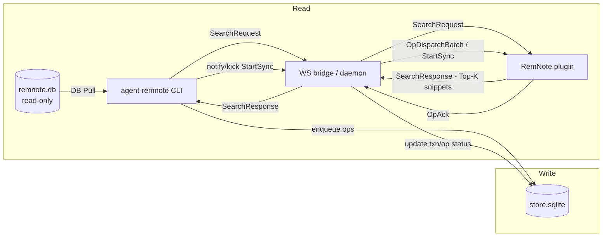

# agent-remnote

[English](README.md) | 简体中文

> 把 RemNote 变成可被 AI/Agent 调用的接口：**本地可读**、**UI 可搜**、**写入安全**。

`agent-remnote` 是一套 CLI + RemNote 插件，把你的 RemNote 知识库变成安全、可自动化的能力面：

- **读（DB Pull）**：对本地 `remnote.db` 做确定性的只读查询。
- **读（Plugin RPC）**：通过 WebSocket 调用 RemNote 插件做“快速候选集搜索”（Top‑K + snippet，结合 UI 上下文）。
- **写（Queue → WS → Plugin）**：通过“操作队列 + WS bridge + 插件执行器（官方 SDK）”安全落库。
- **面向 Agent 的 I/O**：stdout 尽量只输出结果，诊断走 stderr；`--json` 为稳定 envelope。

本仓库主要优化的是“Agent 调用 CLI”的工作流，而不是人类在 UI 里点点点。

## 安全边界（红线）

- 禁止直接修改 RemNote 官方数据库（`remnote.db`）。
- 所有写入必须走「队列 → WS → 插件执行器」链路。

## 为什么要做它？

- RemNote 数据在本地，但天然不“可编程”。
- 直接写 DB 风险极高（索引 / 同步 / 升级都可能被破坏）。
- Agent 需要稳定、可组合的接口（稳定 JSON、可诊断的回退策略）。

## 文档入口

- docs 导航：`docs/README.md`
- 协议与契约（SSoT）：`docs/ssot/agent-remnote/README.md`
- 操作手册（排障 / tmux / 调试等）：`docs/guides/`
- 贡献指南：`CONTRIBUTING.md`
- 安全策略：`SECURITY.md`

## 使用场景（RemNote 侧能获得什么）

- 快速查找 TODO（只读）：`agent-remnote --json todo list --status unfinished --sort updatedAtDesc --limit 20`
- Query 侧的 Todo preset 兼容入口：`agent-remnote --json query --preset todos.list --status unfinished --sort updatedAtDesc --limit 20`
- 通过 Powerup sugar 跑宿主权威查询：`agent-remnote --json query --powerup "Todo" --text "weekly review"`
- 枚举内置 Powerup（只读）：`agent-remnote --json powerup list`
- 解析 Powerup（只读）：`agent-remnote --json powerup resolve --powerup "Todo"`
- 通过主写入面新增结构化数据：`agent-remnote --json table record add --table-tag "<tag_id>" --parent "<parent_id>" --text "..."`
- 把某个 Rem 标记为 Todo（安全写入）：`agent-remnote --json todo add --rem "<rem_id>" --wait`
- 把信息集中到一个地方（安全写入）：`agent-remnote --json rem children append --subject "page:Inbox" --markdown @./note.md`
- 外部信息处理 → 总结 → 自动归档：生成 `./summary.md` 后执行 `agent-remnote --json rem children append --subject "page:Reading" --markdown @./summary.md`

## 031 实验面

下面这些能力已经在当前 worktree 里可用，但还不是 current public stable surface。

- Query V2 的远端 canonical body 统一为 `{ query, limit?, offset?, snippetLength? }`，legacy `queryObj` 只允许停留在 adapter boundary。
- `query --powerup <name>` 只是 authoring sugar。执行前会先走宿主权威 metadata path 规范化，不会把自由文本名字写进 canonical Query V2。
- `query --preset todos.list` 是 `todo list -> query --preset` 的本地兼容桥。remote parity 还没 promotion，所以 `apiBaseUrl` 模式下会返回稳定拒绝。
- 规划中的 `scenario` namespace：
  - `agent-remnote --json scenario schema validate --spec @./scenario.json`
  - `agent-remnote --json scenario schema normalize --spec @./scenario.json`
  - `agent-remnote --json scenario schema explain --spec @./scenario.json --var target_ref=daily:today`
  - `agent-remnote --json scenario schema generate --hint @./hint.json`
  - 查看内置 package：
    - `agent-remnote --json scenario builtin list`
  - 把内置 package 注入用户 scenario 仓：
    - `agent-remnote --json scenario builtin install dn_recent_todos_to_today_move`
    - `agent-remnote --json scenario builtin install --all --if-missing`
  - 默认用户 scenario 仓：
    - `~/.agent-remnote/scenarios/*.json`
  - 当前分支里的计划执行形状：
    - `agent-remnote --json scenario run builtin:dn_recent_todos_to_today_portal --dry-run`
    - `agent-remnote --json scenario run user:dn_recent_todos_to_today_portal --dry-run`
    - 非 builtin 的裸 id 会从 `~/.agent-remnote/scenarios/<id>.json` 解析
    - `--package <spec>` 继续保留为兼容 alias
  - 在 promotion preconditions 完成前，一律把 `scenario run` 视为 planned / experimental surface。

## 安装（用户）

### 前置条件

- RemNote 桌面端（用于运行插件执行器）。
- Node.js 20+（用于运行 CLI）。

### CLI

```bash
npm i -g agent-remnote
agent-remnote --help
```

### RemNote 插件（Executor）

你需要插件来支持 **写入** 与 **Plugin RPC** 读取。

当前不建议把安装路径建立在官方插件市场上。官方 RemNote 插件市场的提交流程还没审核通过前，优先使用下面这个内置的本地 HTTP serve 流程，并通过 RemNote 的 Developer plugin URL 加载。

本地 URL 方式：

1. 启动内置的本地 HTTP 插件服务：

```bash
agent-remnote plugin start
```

这是面向普通用户的推荐路径。它会在后台启动插件服务，并返回可复用的本地 URL。

可配合这些后台治理命令一起使用：

```bash
agent-remnote plugin status
agent-remnote plugin logs --lines 50
agent-remnote plugin stop
```

如果你要前台调试模式，再使用：

```bash
agent-remnote plugin serve
```

`plugin serve` 会把服务绑定在当前终端，并输出接近 Vite 风格的 `Local:`。需要排障时可再加 `--debug` 额外输出 `Dist:`。

2. 在 RemNote → Settings → Plugins → Developer 中填写 `http://127.0.0.1:8080` 作为插件地址。

Zip 方式：

1. 下载 `PluginZip.zip`（如有 Releases，可从 Releases 获取），或从源码构建（见“从源码开发与调试”）。
2. RemNote → Settings → Plugins → Developer → Install From Zip → 选择 `PluginZip.zip`。

### WS bridge（daemon）

```bash
agent-remnote daemon ensure
agent-remnote --json daemon health
```

### 验证已连接

```bash
agent-remnote --json daemon status
```

你应该能看到 `remnote-plugin` client 以及 `activeWorkerConnId`。

### Host API（宿主机 authoritative，本地与远程调用方复用）

如果你希望调用方通过宿主机访问 RemNote，不要直接挂载 `remnote.db` / `store.sqlite`。推荐：

```bash
agent-remnote stack ensure
agent-remnote --json api status
```

直接调 HTTP：

```bash
curl http://127.0.0.1:3000/v1/health
```

远程调用方推荐一次性写入用户配置：

```json
{
  "apiBaseUrl": "http://host.docker.internal:3000"
}
```

`apiBaseUrl` 可以是任何可达的 base URL，也可以直接带前缀路径：

```json
{
  "apiBaseUrl": "https://host.example.com/remnote/v1"
}
```

如果要把 `apiBaseUrl` 暴露到宿主机之外，先放到显式鉴权边界之后。像 `POST /v1/write/apply` 这样的写端点默认只面向受信调用方。

也可以直接用 CLI 写入：

```bash
agent-remnote config set --key apiBaseUrl --value http://host.docker.internal:3000
agent-remnote config set --key apiHost --value 0.0.0.0
agent-remnote config set --key apiPort --value 3001
agent-remnote config set --key apiBasePath --value /v1
agent-remnote config validate
```

保存到 `~/.agent-remnote/config.json` 后，业务命令继续按原样调用：

```bash
agent-remnote search --query "keyword"
agent-remnote queue wait --txn "<txn_id>"
agent-remnote plugin selection current
agent-remnote plugin selection current --compact
agent-remnote plugin current --compact
```

严格 remote mode 规则：

- 配置了 `apiBaseUrl` 之后，业务命令必须走宿主机 Host API。
- `REMNOTE_API_BASE_URL` 与用户配置 `apiBaseUrl` 在语义上完全等价，只是优先级来源不同。
- `apiBasePath` 只影响监听与状态输出里的 URL 组装；若 `apiBaseUrl` 已经自带路径前缀，则优先使用该前缀。
- 哪些命令属于必须保持 local/remote 对等的 RemNote business commands，以
  `docs/ssot/agent-remnote/runtime-mode-and-command-parity.md` 为唯一权威源。
- 仍依赖本地 DB 或本地文件系统的命令会直接 fail fast，不再静默回落到本地读取。
- 只是在 CLI 侧编译 `ops` 的 deferred 写命令，在 remote mode 下也必须走宿主机 Host API，不能把事务写到调用端本地 store。
- 当前已支持远程模式的代表性命令包括 `search`、`queue wait`、`plugin current`、`rem outline`、`daily rem-id`、`daily write` 与 `rem children *`。
- 远程模式下的结构化写入，使用 `daily write --markdown ...`、`rem children ...` 或 `apply --payload ...`。
- `powerup todo ...` 是 Todo 命令族的 canonical 路径，顶层 `todo ...` 继续保留为高频 alias。

需要临时覆盖时仍可使用：

```bash
REMNOTE_API_BASE_URL=http://host.docker.internal:3000 agent-remnote queue wait --txn "<txn_id>"
agent-remnote --api-base-url http://host.docker.internal:3000 plugin current --compact
agent-remnote --api-host 127.0.0.1 --api-port 3001 --api-base-path /v2 --json config print
```

## 快速开始（用户）

Plugin RPC（快速候选集，需要 RemNote 窗口 + 插件已连接）：

```bash
agent-remnote --json plugin search --query "keyword" --timeout-ms 3000
```

DB Pull（确定性回退，不依赖插件）：

```bash
agent-remnote --json search --query "keyword" --timeout-ms 30000
```

安全兜底：多数 list 类只读命令默认带分页 `--limit`（并有上限），避免在大库上一口气扫太多导致卡死。

安全写入 + 进度查询：

```bash
agent-remnote --json rem children append --subject "page:Inbox" --markdown @./note.md --idempotency-key "inbox:note:2026-01-25"
agent-remnote --json queue wait --txn "<txn_id>"
```

## 真实场景（可复制 recipes）

所有写入场景都要求：RemNote 窗口 + 插件已连接（active worker）且 daemon 正常运行。检查：`agent-remnote --json daemon status`。

### 1) 研究总结 → 归档到 Reading 页面（Markdown 导入）

```bash
agent-remnote --json rem children append --subject "page:Reading" --markdown @./summary.md --idempotency-key "reading:summary:2026-01-26"
agent-remnote --json queue wait --txn "<txn_id>"
```

### 2) Daily Notes 日记（追加 / 前插）

```bash
agent-remnote --json daily write --markdown @./daily.md --create-if-missing --idempotency-key "daily:2026-01-26:journal"
agent-remnote --json queue wait --txn "<txn_id>"
```

也支持直接传 Markdown 或从 stdin 读取：

```bash
agent-remnote --json daily write --markdown $'- topic\n  - note' --wait
cat <<'MD' | agent-remnote --json daily write --markdown - --wait
- topic
  - note
MD
```

护栏：如果 `--text` 的输入看起来像结构化 Markdown，CLI 会 fail-fast，并提示改用 `--markdown`。只有在你明确要保留字面 Markdown 时才用 `--force-text`。

### 3) 多步依赖写入（`apply --payload`）

创建 `plan.json`：

```json
{
  "version": 1,
  "kind": "actions",
  "actions": [
    { "as": "idea", "action": "write.bullet", "input": { "parent_id": "id:<parentRemId>", "text": "First bullet" } },
    { "action": "rem.children.append", "input": { "rem_id": "@idea", "markdown": "- child note" } }
  ]
}
```

```bash
agent-remnote --json apply --payload @plan.json --idempotency-key "plan:demo:2026-01-26"
agent-remnote --json queue wait --txn "<txn_id>"
```

`apply` 里的 action/op payload 若带 `markdown` 字段，也会按 `--markdown` 同一套 input-spec 规则展开：支持 inline 文本、`@file`、`-` 与 `@@literal`。

对于 `kind=actions`，runtime 可能会把连续、等价的 scalar action 静默收口成 internal bulk op，以降低 queue / WS / ack 开销。这个优化对 caller 透明：继续使用业务语义 action 即可，不要依赖 `ops.length === actions.length`。

## 如何使用（面向 Agent）

### 读取：双通道互补

1. **Plugin RPC（快速候选集）**  
   需要 RemNote 窗口 + 插件已连接（active worker）。返回 Top‑K 候选 + snippet。

```bash
agent-remnote --json plugin search --query "keyword" --timeout-ms 3000
```

2. **DB Pull（确定性回退）**  
   直接对 `remnote.db` 做只读查询（不依赖插件）。

```bash
agent-remnote --json search --query "keyword" --timeout-ms 30000
```

当 Plugin RPC 不可用时，会返回 `ok=false`，并给出 `error.code` 与 `nextActions`（始终可回退到 DB Pull）。

### 写入：队列 + 插件执行器

写入永远不直接落到 `remnote.db`，而是走队列并由插件通过官方 SDK 执行。

```bash
agent-remnote --json rem children append --subject "page:Inbox" --markdown @./note.md --idempotency-key "inbox:note:2026-01-25"
agent-remnote --json queue wait --txn "<txn_id>"
```

建议：对“同一次逻辑写入”始终传入稳定的 `--idempotency-key`，这样重试不会产生重复 Rem。

### 批量写入安全约定（bundle）

当内容很大时，把大量 Rem 直接插入到既有页面的根下既危险也难清理。

`rem children append/prepend/replace` 与 `daily write` 支持 **bundle 模式**：当输入很大（默认：≥80 行或 ≥5000 字符）时，会先创建一个“容器 Rem”，把导入内容写入容器子树；**容器 Rem 的文本即 bundle title**。

对于 `daily write --markdown`，如果 auto 路径的输入本身已经是单一顶层根节点的大纲，CLI 默认保留原结构，不再额外包一层 bundle。只有显式强制或传入 `--bundle-title` 才会加容器。

- 禁用 bundling：`--bulk never`
- 强制 bundling：`--bulk always`
- 自定义容器：`--bundle-title ...`
- 减少 UI “逐层出现” 抖动：`--staged`（先在临时容器下完成导入，最后一次性移动到目标 parent）

示例：

```bash
agent-remnote --json daily write --markdown @./big.md \
  --bundle-title "X thread：Remotion 工作流 — Remotion + 多个 skill 的一键成片流程；按 TTS 分段时长裁剪片段" \
  --idempotency-key "reading:x:2015245301603549328"
agent-remnote --json queue wait --txn "<txn_id>"
```

### 指向正确窗口：active worker

系统会选举“最近使用过的 RemNote 会话”为 **active worker**：

- 只有 active worker 允许消费队列；
- Plugin RPC（例如 `plugin search`）也默认路由到 active worker。

如果你开了多个 RemNote 窗口：点一下你想要操作的那个窗口即可完成切换。

### Agent 集成（Skill）— Claude Code / Codex

本仓库提供一个 `remnote` Skill（遵循 Agent Skills spec）。推荐用 https://github.com/vercel-labs/add-skill 一键安装：

```bash
npx add-skill https://github.com/yoyooyooo/agent-remnote -g -a codex -a claude-code -y --skill remnote
```

## 常用命令速查

| 目标                               | 命令                                                                                                                                              |
| ---------------------------------- | ------------------------------------------------------------------------------------------------------------------------------------------------- |
| 健康检查                           | `agent-remnote --json daemon health`                                                                                                              |
| 查看 daemon/clients/active worker  | `agent-remnote --json daemon status`                                                                                                              |
| 插件候选集搜索（Top‑K）            | `agent-remnote --json plugin search --query "..."`                                                                                                |
| DB 搜索（回退）                    | `agent-remnote --json search --query "..."`                                                                                                       |
| 读取 UI 上下文（IDs）              | `agent-remnote --json plugin ui-context snapshot`                                                                                                 |
| 解析今日 Daily Note 条目 ID        | `agent-remnote --ids daily rem-id`                                                                                                                |
| 解析指定日期 Daily Note 条目 ID    | `agent-remnote --json daily rem-id --date "2026-03-08"`                                                                                           |
| 追加 Markdown 到某个 Rem 的子级    | `agent-remnote --json rem children append --subject "page:..." --markdown @./note.md`                                                            |
| 顶部插入 Markdown 到某个 Rem 的子级 | `agent-remnote --json rem children prepend --subject "page:..." --markdown @./note.md`                                                           |
| 替换某个 Rem 的直接子级            | `agent-remnote --json rem replace --subject "page:..." --surface children --markdown @./note.md`                                                 |
| 就地替换当前选中的并列 Rem         | `agent-remnote --json rem replace --selection --surface self --markdown @./note.md`                                                                |
| 清空某个 Rem 的直接子级            | `agent-remnote --json rem children clear --subject "<rem_id>" --wait`                                                                            |
| 以内联 Markdown 写 Daily Note      | `agent-remnote --json daily write --markdown $'- topic\n  - note' --wait`                                                                         |
| 从 stdin 写 Daily Note Markdown    | `cat note.md \| agent-remnote --json daily write --markdown - --wait`                                                                             |
| 创建 Portal（传送门）              | `agent-remnote --json portal create --to "id:<rem_id>" --at "parent:id:<parent_id>" --wait`                                                     |
| 读取 typed outline 节点            | `agent-remnote --json rem outline --id "<rem_id>" --depth 3 --format json`                                                                        |
| 查询归一化 recent activity         | `agent-remnote --json db recent --days 7 --kind all --aggregate day --aggregate parent --timezone Asia/Shanghai --item-limit 20 --aggregate-limit 10` |
| 创建短子项 Rem                     | `agent-remnote --json rem create --at "parent:id:<parent_id>" --text "..." --wait`                                                               |
| 把 Markdown 沉淀成独立 page       | `agent-remnote --json rem create --at standalone --is-document --title "..." --markdown @./note.md --portal "at:parent:daily:today" --wait`     |
| 提级已有内容到新 destination      | `agent-remnote --json rem create --at standalone --title "..." --from "id:<rem_id>" [--from "id:<rem_id>"] --wait`                              |
| 移动 Rem                           | `agent-remnote --json rem move --subject "id:<rem_id>" --at "parent[0]:id:<parent_id>" --wait`                                                  |
| 提级单个 Rem 并原地留 portal      | `agent-remnote --json rem move --subject "id:<rem_id>" --at standalone --is-document --portal in-place --wait`                                   |
| 更新 Rem 文本                      | `agent-remnote --json rem set-text --subject "<rem_id>" --text "..." --wait`                                                                     |
| 给 Rem 加 Tag                      | `agent-remnote --json tag add --tag "<tag_id>" --to "<rem_id>" [--to "<rem_id>"]`                                                              |
| 给 Rem 移除 Tag                    | `agent-remnote --json tag remove --tag "<tag_id>" --to "<rem_id>" [--to "<rem_id>"]`                                                           |
| Powerup schema（只读检查）         | `agent-remnote --json powerup schema --powerup "Todo" --include-options`                                                                          |
| Todo：标记完成                     | `agent-remnote --json todo done --rem "<rem_id>" --wait`                                                                                          |
| Table：创建表                      | `agent-remnote --json table create --table-tag "<tag_id>" --parent "<parent_id>" --wait`                                                          |
| Table：新增一行                    | `agent-remnote --json table record add --table-tag "<tag_id>" --parent "<parent_id>" --text "..."`                                                |
| 删除 Rem                           | `agent-remnote --json rem delete --subject "<rem_id>" [--max-delete-subtree-nodes 100]`                                                         |
| 结构化多步写入                    | `agent-remnote --json apply --payload @plan.json`                                                                                                 |
| raw ops 入队（advanced）           | `agent-remnote --json apply --payload @ops.json`                                                                                                  |
| 列出 backup artifact               | `agent-remnote --json backup list`                                                                                                                |
| dry-run 清理 orphan backup         | `agent-remnote --json backup cleanup`                                                                                                             |
| 定向 dry-run 清理指定 backup       | `agent-remnote --json backup cleanup --backup-rem-id "<backup_rem_id>" [--max-delete-subtree-nodes 100]`                                        |
| 等待完成                           | `agent-remnote --json queue wait --txn "<txn_id>"`                                                                                                |
| 队列统计                           | `agent-remnote --json queue stats`                                                                                                                |
| 队列统计（含冲突摘要）             | `agent-remnote --json queue stats --include-conflicts`                                                                                            |
| 查看冲突面报告                     | `agent-remnote --json queue conflicts`                                                                                                            |
| dry-run 清理终态队列记录           | `agent-remnote --json queue cleanup`                                                                                                              |
| 查看日志                           | `agent-remnote daemon logs --lines 200`                                                                                                           |

多数写入命令也支持 `--wait --timeout-ms <ms> --poll-ms <ms>`，用于一次调用闭环确认 txn 终态。进入 wait-mode 后，优先解析 `id_map`；`rem_id`、`portal_rem_id` 这类字段只是从同一映射派生出来的便捷字段。

`rem delete` 的 CLI 形式没有变化，但插件侧现在默认走前端本地 `safeDeleteSubtree` 安全删除策略：小子树直接整棵删除，超阈值的大树会先切成多个阈值内的小子树再删。要试探不同阈值时，可以按次传 `--max-delete-subtree-nodes <n>`，不需要重新 reload 插件。

## 运行版本排查

本地持续迭代时，优先看这几条：

```bash
agent-remnote --json daemon status
agent-remnote --json plugin status
agent-remnote --json api status
agent-remnote --json stack status
agent-remnote --json doctor
agent-remnote --json doctor --fix
```

现在这些输出会直接给出：

- `runtime`：当前 CLI / 会话构建
- `service.build`：当前 live daemon / api / plugin-server 进程构建
- `clients[].runtime` 或 `active_worker.runtime`：当前 live RemNote 插件构建
- `warnings`：当你连到旧 daemon / 旧 api / 旧 plugin 时的明确告警
- `doctor.queue.schema`：当前 store schema 版本与支持版本
- `doctor.checks[]`：稳定的 runtime/config/package/env 检查项 id
- `doctor.fixes[]`：`doctor --fix` 实际执行过的安全修复动作
- `doctor.restart_summary`：安全修复后的 best-effort runtime 重启结果

如果改了代码但 `build_id` 还旧，直接重启对应进程：

```bash
agent-remnote --json daemon restart --wait 15000
agent-remnote --json api restart
agent-remnote --json plugin restart
```

`doctor --fix` 的默认安全边界：

- 清理 stale daemon / api / plugin pid 或 state 文件
- 把支持的用户配置形态重写成 canonical keys
- 把发布包完整性检查留在 `doctor` 诊断输出中汇报
- 汇报 `restart_summary`，但默认不自动重启后台服务

`doctor --fix` 不会修改 queue 内容、`remnote.db` 或用户内容数据。

发布包保证：

- npm 安装态加载 builtin scenarios 时不依赖 source-tree 路径
- plugin artifacts 属于发布完整性检查的一部分
- `search --json` 成功返回时，stdout 只输出单个 JSON envelope

## 可选：tmux statusline（右下角 RN 段）

如果你日常在 tmux 里工作，本仓库提供了一个轻量脚本，用来在右下角显示 `RN` 段，实时反映 daemon 的存活/连接状态与 UI selection：

- daemon 未运行 / state file stale：不显示（输出为空）
- daemon 已运行但无连接：灰底
- daemon 已运行且有连接：暖底（并随 selection 显示 `RN` / `TXT` / `N rems`）
- 当队列存在待处理任务时追加 `↓N`（`pending` + `in_flight`）

实现上直接读取 daemon 的 state file（`~/.agent-remnote/ws.bridge.state.json`）与 store DB，因此 tmux 渲染时不需要每次都启动 Node/CLI。

- tmux 友好脚本：`scripts/tmux/remnote-right-segment.tmux.sh`
- 底层 value 脚本（返回 `"<bg>\t<value>"`）：`scripts/tmux/remnote-right-value.sh`

fast path 依赖：建议安装 `jq`（解析 state file），`sqlite3` 可选（用于 `↓N`）；缺少 `jq` 时会降级到 best-effort CLI fallback。

接线示例与可配置项见：`docs/guides/tmux-statusline.md`

## 架构一图流（Read/Write）



## 常见问题 / 排障

- `agent-remnote daemon ensure` 打印 `started: false`：可能表示“当前已经健康，无需启动”；用 `agent-remnote --json daemon status` 确认即可。
- `agent-remnote stack ensure`：一条命令确保当前 owner/profile 下的 `daemon + api + plugin` 都就绪。
- `agent-remnote stack stop`：一条命令停止当前本地 `daemon + api + plugin` bundle。
- `agent-remnote stack takeover --channel dev`：把 canonical fixed-owner claim 切到 `dev`，并 best-effort 拉起本地 dev bundle。
- `agent-remnote stack takeover --channel stable`：把 canonical fixed-owner claim 切回 `stable`，停止当前 dev bundle；若配置了 stable launcher，则会触发它。
- 如需等插件 worker 真正回到 active 状态：`agent-remnote stack ensure --wait-worker --worker-timeout-ms 15000`
- `daemon status` 里看不到 `remnote-plugin`：重新安装插件 Zip，并保持 RemNote 窗口打开。
- Plugin RPC 失败 / 没有 `activeWorkerConnId`：点一下目标 RemNote 窗口，让 UI 活跃度刷新。
- `agent-remnote --json config print`：查看当前解析出来的 `runtime_profile`、`runtime_port_class`、`control_plane_root`、`runtime_root`、`fixed_owner_claim`。
- `agent-remnote --json stack status`：查看 `resolved_local`、`fixed_owner_claim`、每个 service 的 owner 状态，以及 `ownership_conflicts[]`。

## 配置（环境变量 / 参数）

- RemNote DB（只读）：`--remnote-db` / `REMNOTE_DB`
- Store DB：`--store-db` / `REMNOTE_STORE_DB` / `STORE_DB`
  - 发布安装态默认：`~/.agent-remnote/store.sqlite`
  - source worktree 默认：隔离的 `~/.agent-remnote/dev/<worktree-key>/store.sqlite`
  - legacy：`--queue-db` / `REMNOTE_QUEUE_DB` / `QUEUE_DB`
- WS 地址：`--daemon-url` / `REMNOTE_DAEMON_URL` / `DAEMON_URL`（或 `--ws-port` / `REMNOTE_WS_PORT` / `WS_PORT`）
  - 发布安装态默认端口：`6789`
  - source worktree 默认端口：按解析后的 runtime root 派生 deterministic isolated port
- Host API remote mode 来源：`--api-base-url` / `REMNOTE_API_BASE_URL` / 用户配置 `apiBaseUrl`
- Host API 监听地址：`--api-host` / `REMNOTE_API_HOST` / 用户配置 `apiHost`（默认 `0.0.0.0`）
- Host API 端口：`--api-port` / `PORT` / `REMNOTE_API_PORT` / 用户配置 `apiPort`
  - 发布安装态默认端口：`3000`
  - source worktree 默认端口：按解析后的 runtime root 派生 deterministic isolated port
- Host API 基础路径：`--api-base-path` / `REMNOTE_API_BASE_PATH` / 用户配置 `apiBasePath`（默认 `/v1`）
- 用户配置文件覆盖：`--config-file` / `REMNOTE_CONFIG_FILE`
- Host API pid/log/state（仅 env）：`REMNOTE_API_PID_FILE` / `REMNOTE_API_LOG_FILE` / `REMNOTE_API_STATE_FILE`
- WS state file：`REMNOTE_WS_STATE_FILE` / `WS_STATE_FILE`
  - 发布安装态默认：`~/.agent-remnote/ws.bridge.state.json`
  - source worktree 默认：隔离 runtime root 下的 `ws.bridge.state.json`
- daemon pidfile（仅 env）：`REMNOTE_DAEMON_PID_FILE` / `DAEMON_PID_FILE`
- daemon log file（仅 env）：`REMNOTE_DAEMON_LOG_FILE` / `DAEMON_LOG_FILE`
- plugin pid/log/state（仅 env）：`REMNOTE_PLUGIN_SERVER_PID_FILE` / `REMNOTE_PLUGIN_SERVER_LOG_FILE` / `REMNOTE_PLUGIN_SERVER_STATE_FILE`
- active worker（自动）：由最近的 RemNote UI 活跃度（selection/uiContext）决定；可用 `agent-remnote --json daemon status` 查看 `activeWorkerConnId`
- repo：`--repo` / `AGENT_REMNOTE_REPO`
- WS 调度器（仅 env）：`REMNOTE_WS_SCHEDULER`（设为 `0` 可关闭冲突调度；仅用于排障）
- tmux refresh（仅 env）：`REMNOTE_TMUX_REFRESH` / `REMNOTE_TMUX_REFRESH_MIN_INTERVAL_MS`
- statusLine 文件模式（仅 env）：`REMNOTE_STATUS_LINE_FILE` / `REMNOTE_STATUS_LINE_MIN_INTERVAL_MS` / `REMNOTE_STATUS_LINE_DEBUG` / `REMNOTE_STATUS_LINE_JSON_FILE`
- tmux statusline（右下角 RN 段）：见 `docs/guides/tmux-statusline.md`

可用 `agent-remnote config path` 查看当前用户配置文件路径，用 `config list/get/set/unset/validate` 管理用户配置文件；`config set` 支持 `apiBaseUrl`、`apiHost`、`apiPort`、`apiBasePath`；`config print` 可查看最终解析出来的 profile/root/default/claim 结果（含覆盖值）。

## 从源码开发与调试（最后一环）

### 1) 安装依赖

```bash
bun install
```

### 2) 启动 WS bridge（daemon）

```bash
npm run dev:ws
```

默认 WS：`ws://localhost:6789/ws`

### 3) 构建插件 Zip

```bash
cd packages/plugin
npm run build
```

产物：`packages/plugin/PluginZip.zip`

### 4) 从源码启动插件静态服务器

```bash
npm run dev -- plugin serve
```

默认地址：`http://127.0.0.1:8080`

后台管理命令与 API/daemon 保持同型：

```bash
npm run dev -- plugin ensure
npm run dev -- plugin status
npm run dev -- plugin stop
```

### 5) 从源码运行 CLI

```bash
npm run dev -- --help
```

### 6) 质量门禁

```bash
npm run check
```

### 7) Turbo 快捷入口

本地全仓验证：

```bash
npm run test:turbo
npm run typecheck:turbo
npm run lint:turbo
```

按当前分支相对 `origin/master` 做增量验证：

```bash
npm run test:turbo:affected
npm run typecheck:turbo:affected
npm run lint:turbo:affected
```

如果本地 `origin/master` 不新，先执行：

```bash
git fetch origin master
```

## 发布

本仓库使用 Changesets 管理 npm 发版。

- 对每个值得发版的 `agent-remnote` 变更添加一个 changeset
- 合并到 `master`
- GitHub Actions 自动开/更新版本 PR
- 合并该版本 PR 后自动发布 npm 新版本并更新 changelog

维护者操作手册：`docs/runbook/release.md`

## 参与贡献

欢迎提 Issue / PR。提交前请先阅读 `CONTRIBUTING.md`，其中包含环境准备、代码规范与验证要求。

## 安全问题

如果发现安全漏洞，请按 `SECURITY.md` 提供的渠道私下披露，不要直接公开提 issue。

## 许可证

MIT，见 `LICENSE`。
